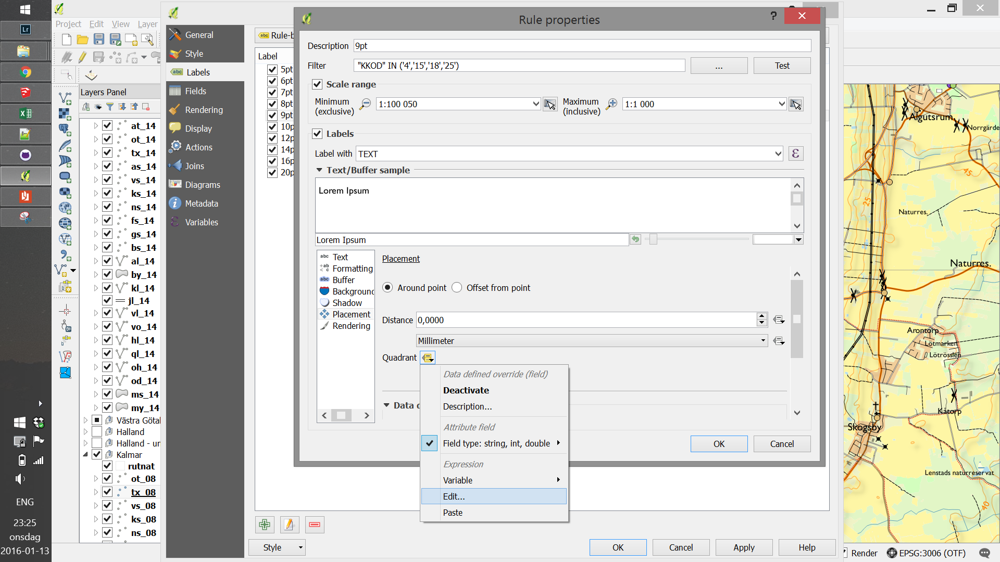
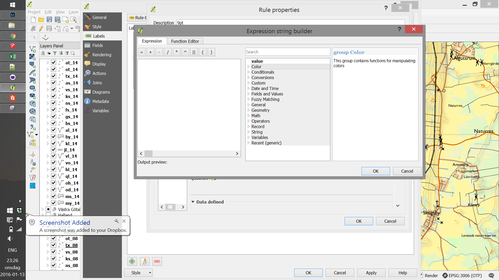
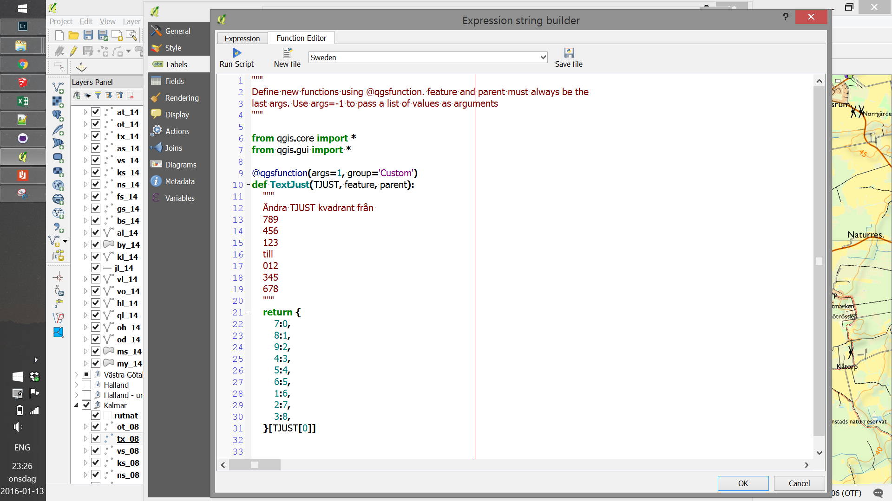
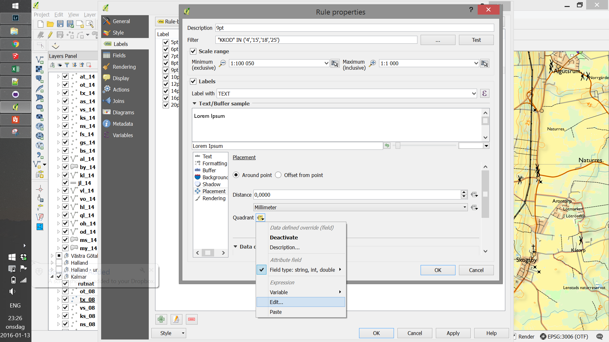
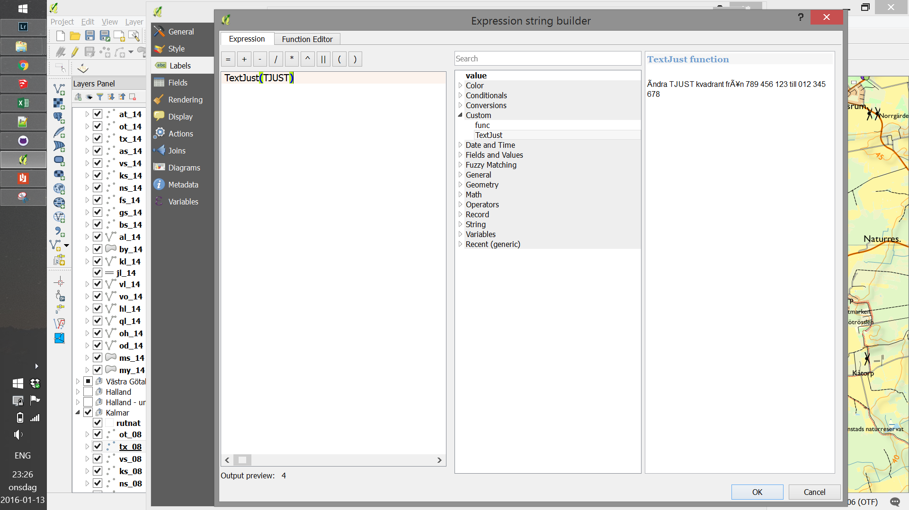

# Textjustering

Lantmäteriet Terrängkartan - justering av texter (TJUST)

I vissa av filerna från Lantmäteriet finns det ett fält som heter TJUST.
Detta fältet är till för att placera en text eller symbol kring den aktuella punkten.

Lantmäteriet har definierat hur denna variabel används i sin dokumentation enligt följande:

7 8 9

4 5 6

1 2 3

Problemet som uppstår när man vill justera enligt ovan i QGIS är att där definieras samma sak enligt:

0 1 2

3 4 5

6 7 8 

Exempel:

Om TJUST = 7 (vänstra toppen) i LM's fil så hamnar istället texten centrerat under punkten.
För att lösa detta kan man skriva en enkel funktion för att översätta mellan LM's och QGIS definition
 
För att sätta en textjustering så väljs normalt sett vilket fält via "Quadrant"->Field type...->Fältnamn
Detta fungerar dock inte så bra med LM's filer 

Välj istället Edit...

Här kommer ett fönster upp för att skapa ett eget datauttryck för vilken data som skall användas,
välj "Function Editor"-fliken

Här kan man skapa en ny funktion, det finns flera videos på Youtube som visar hur detta 
fungerar. För detta syftet så skriv av min kod eller kopiera ut den från filen "funktion.txt" 
som ligger i denna GitHub-katalog.

När funktionen är på plats tryck OK för att gå tillbaka till föregående fönster,
välj Edit... på nytt

Nu kan funktionen som vi lagt in väljas under "Custom" eller skrivas in för hand.

Den parameter som vi vill använda är TJUST, klicka OK så är allt klart

För att kontrollera vilken funktion som används kan man se detta som "Current: ..." 

